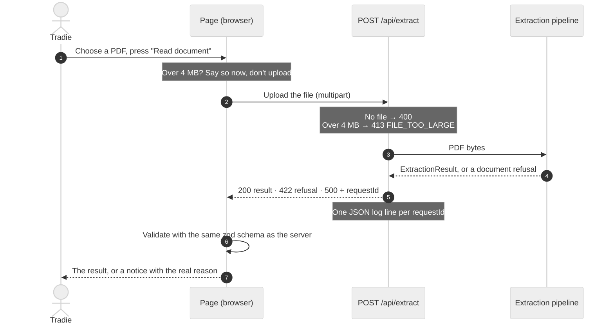
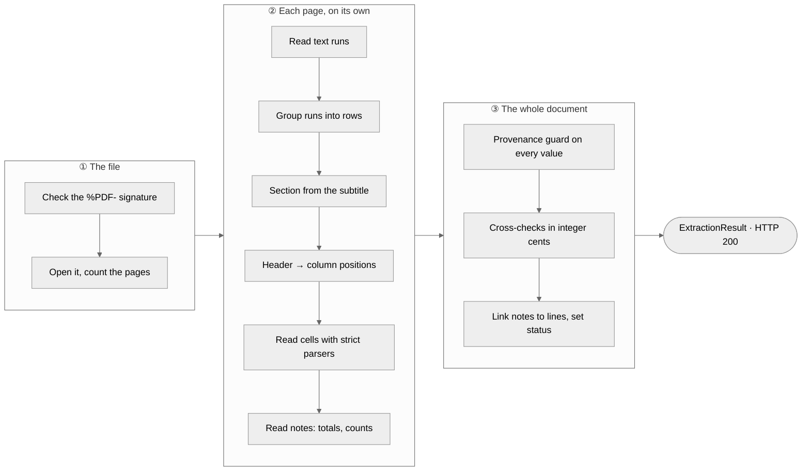
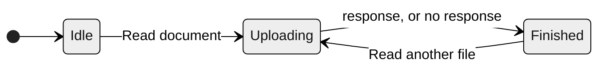

# Insta Quote · PDF extraction with evidence and refusals

Take-home for Insta Quote AI (full-stack).

- **Part A:** `POST /api/extract` takes a supplier PDF and returns JSON. The JSON holds the line items it could extract, each value with its page and the exact printed row it came from, plus a separate list of what it refused to extract and why.
- **Part B:** a single page that uploads a PDF and shows the result, with every refusal written in plain language for a tradie.

**Live demo:** https://insta-quote-extract.vercel.app. Upload any PDF from [`fixtures/pdfs`](fixtures/pdfs), or call the API at `https://insta-quote-extract.vercel.app/api/extract`. Every push to `main` deploys there automatically.

**The hard rule this is built around:** never output a number you can't point to. Refusing is a valid result; guessing is not.

- Brief, spec and fixture notes: [`docs/TASK.md`](docs/TASK.md), [`docs/SPEC.md`](docs/SPEC.md), [`docs/FIXTURES.md`](docs/FIXTURES.md)
- Every judgment call, with its cost: [`docs/DECISIONS.md`](docs/DECISIONS.md) (D1–D14 + known limitations)

## Run it

Needs Node ≥ 22.

```bash
npm install
npm run dev                # http://localhost:3000
npm test                   # 392 tests (vitest, node + jsdom)
npm run typecheck
npm run lint
npm run extract:fixtures   # writes out/<fixture>.json for every sample PDF
```

## API

```bash
curl -F "file=@fixtures/pdfs/KBS-10262.pdf" https://insta-quote-extract.vercel.app/api/extract
```

A trimmed real response:

```json
{
  "status": "needs_review",
  "lineItems": [
    {
      "id": "p1-l1",
      "section": "packing_list",
      "quantity": {
        "value": 96,
        "raw": "96",
        "evidence": { "page": 1, "sourceText": "1 10mm GIB Standard board 2400x1200 96 sheet $24.90 $2,390.40" }
      }
    }
  ],
  "refusals": [
    {
      "code": "CONFLICTING_VALUES",
      "scope": "document",
      "candidates": [
        { "value": 14, "raw": "14 pallets", "evidence": { "page": 1, "sourceText": "Summary: 14 pallets loaded at depot, all strapped and wrapped." } },
        { "value": 16, "raw": "16 pallets", "evidence": { "page": 1, "sourceText": "Driver notes: 16 pallets unloaded at site, all accounted for on the day." } }
      ],
      "userMessage": "The number of pallets doesn't match: the document says \"14 pallets\" and \"16 pallets\" in different places. We haven't picked one.",
      "suggestedAction": "Check with the supplier or driver which number of pallets is correct."
    }
  ]
}
```

Each extracted value is `{ value, raw, evidence: { page, sourceText, bbox } }`:

- `raw` is exactly what was printed (`"$68.00 /bag"`, not `68`).
- `raw` is always a substring of `sourceText`.
- `sourceText` is always a line of that page's text.

| Case | Status | Body |
|---|---|---|
| Processed, **including when everything was refused** | 200 | `ExtractionResult` |
| No file / body isn't multipart | 400 | `{ error: { code: "NO_FILE", userMessage, requestId } }` |
| Over 4 MB | 413 | `{ refusal: FILE_TOO_LARGE, requestId }` |
| Not a PDF (by magic bytes), encrypted, 0 pages | 422 | `{ refusal, requestId }` |
| Real failure | 500 | honest message + `requestId`, no stack |

- **Request ids:** every response carries `x-request-id`.
- **Logging:** each request writes one JSON log line (request id, status, page count, refusal codes, duration).
- **One schema:** the client validates every response with the same zod schema as the server.

## Results on the six samples

Produced by `npm run extract:fixtures`. These results match [`fixtures/expected.json`](fixtures/expected.json) exactly: status, line count, line values, the exact set of refusals, totals and page statuses. `tests/fixtures.test.ts` asserts this on every run.

| File | Trap | Status | Lines | Printed total | Refusals |
|---|---|---|---|---|---|
| KBS-10234 | none (clean control) | complete | 5 | $2,630.00 | none |
| KBS-10241 | whole file is a scan | nothing_extracted | 0 | — | NO_TEXT_LAYER p1 |
| KBS-10255 | no Unit / Line Total columns, weights with no basis | needs_review | 4 | — | COLUMN_NOT_PRESENT ×2, AMBIGUOUS_UNIT_BASIS ×3 |
| KBS-10262 | 14 pallets loaded vs 16 unloaded | needs_review | 3 | $5,122.40 | CONFLICTING_VALUES (both candidates, none chosen) |
| KBS-10270 | lines don't add up to the printed total | needs_review | 4 | $1,612.90 | TOTAL_MISMATCH (cites only the printed total) |
| KBS-DR118 | 8 pages: p4 scanned, p5–8 not deliveries | needs_review | 21 | — | NO_TEXT_LAYER p4, NON_DELIVERY_SECTION p5–8 |

What that means in practice:

- **KBS-10255:** `$68.00 /bag` gives `priceBasis: "bag"`, but the quantity gets **no unit**. Nothing is computed: no line totals (272, 108, …) and no summed weights.
- **KBS-10270:** 1,538.20 and 74.70 (the sum and the gap) appear nowhere in the JSON or on screen, and there is no invented "freight" line.
- **KBS-DR118:** the 9 delivery lines and the 12 summary/returns/credit/acceptance lines are tagged by section and never summed together. Page 4 failing doesn't affect pages 1–3 or 5–8.

## How it works

### One request, end to end



### The extraction pipeline

The pipeline runs in three stages. Stage 2 runs separately for each page, so one bad page can't take down the others. The provenance guard and the cross-checks run once, over the whole document, after every page is read.



**Where each refusal comes from.** A refusal is raised at the smallest scope that fits, and everything outside that scope is kept.

| Stage | What went wrong | Refusal | Scope | What happens |
|---|---|---|---|---|
| Upload | File over 4 MB | `FILE_TOO_LARGE` | document | HTTP 413, nothing read |
| ① File | Not a PDF, password-protected, or no pages | `NOT_A_PDF` · `ENCRYPTED` · `EMPTY_DOCUMENT` | document | HTTP 422, nothing read |
| ② Page | No text layer (a scan) | `NO_TEXT_LAYER` | page | That page is skipped; the others continue |
| ② Page | The page throws, or cites text that isn't on it | `PAGE_PARSE_FAILED` | page | That page is skipped; the others continue |
| ② Page | Summary / returns / credit / acceptance page | `NON_DELIVERY_SECTION` | page | Lines kept and tagged, not counted as delivered; their counts are left out of the conflict check |
| ② Page | No table header, a repeated column, or no items under the header | `UNRECOGNISED_LAYOUT` | page | Nothing taken from that page |
| ② Page | No Unit or Line Total column | `COLUMN_NOT_PRESENT` | page | One note per missing column; nothing is computed to fill it |
| ② Cell | Blank, `TBC`, `N/A`; or `1.250`, `approx 20` | `MISSING_VALUE` · `AMBIGUOUS_NUMBER_FORMAT` | field | That value is left out; the rest of the line is kept |
| ② Cell | A weight like `25kg` with no per-item or total | `AMBIGUOUS_UNIT_BASIS` | field | Kept exactly as printed, and flagged |
| ③ Guard | A value that isn't in its source row, on its page | `VALUE_NOT_IN_SOURCE` | field | That value is dropped |
| ③ Checks | Qty × unit price ≠ printed line total | `LINE_ARITHMETIC_MISMATCH` | line | All three printed values shown; none corrected |
| ③ Checks | Lines don't add up to the printed total | `TOTAL_MISMATCH` | document | Only the printed total is cited; no sum or gap is shown |
| ③ Checks | One count noun with different numbers ("14 pallets" / "16 pallets") | `CONFLICTING_VALUES` | document | Every mention listed with its source; none chosen |

### The page (Part B)



The page state is one discriminated union. `Finished` holds exactly one of these outcomes, and each has its own message:

| Outcome | When | What the user sees |
|---|---|---|
| `result` | 200, **including when everything was refused** | Summary banner, page chips, "Needs your attention", then page by page with each problem next to its row |
| `rejected` | 422 | The refusal's own message, what to do, and a reference |
| `tooLarge` | Over 4 MB (checked before upload), or a 413 from the platform | The 4 MB limit in plain words |
| `badRequest` | 400 | "We didn't receive a file…" |
| `serverError` | 500 | An honest message and the reference to quote |
| `networkError` | The request never reached the server | "Couldn't reach the server. Check your connection and try again." |
| `invalidResponse` | Not JSON, or fails the shared schema | "The server sent a response we couldn't understand", with the reference if there is one |

None of them says "something went wrong".

**Extraction is deterministic.** It parses the PDF text layer by coordinates, with no LLM and no OCR (D1, D2). Column positions come from the header text; none are hard-coded.

**Cross-checks run on integer cents.** The cents are re-parsed from the printed `raw` strings, and the cross-checks never write a computed number into the output (D3).

**Refusals are scoped as small as possible,** in the order document > page > line > field. One scanned page doesn't sink the file, and one unreadable cell doesn't sink its line (D4, D10).

The rules are enforced by tests, not just by the code:

- **`fixtures.test.ts`** checks these properties on every fixture:
  - Every `Evidenced` value anywhere in the result traces back to a line of the page it names.
  - Every number shown to the user is a whole token printed in the PDF.
  - No `forbiddenInOutput` string appears.
- **`pipeline.test.ts`** checks containment and the provenance guard:
  - A test forces page 2 to throw, and pages 1 and 3 still come through.
  - Forged values are dropped, and the forged number appears nowhere.
- **`result-view.test.tsx` and `page-states.test.tsx`** check the screen:
  - Every refusal's message reaches the screen **word for word**, for every fixture and every HTTP outcome.
  - Planting the brief's exact bug (`"Something went wrong"`) makes these tests fail. I checked this and then reverted it.

## The three questions

### What was the hardest decision, and why did I choose that way?

**Refusing scanned pages instead of running OCR (D2).**

KBS-10241 is perfectly legible to a person, and its arithmetic is consistent. The product mindset is "say yes", so returning nothing for it is uncomfortable, and I'm least sure of this refusal from a product point of view.

I still chose to refuse, because OCR output is itself a guess about pixels. A `3` read as `8`, or a `1` read as `7`, becomes a confident number in a quote, and the rule is that a confidently wrong number is worse than a clear "we couldn't read this". Without per-token confidence and a human confirmation step, OCR text doesn't meet the bar of "the exact source text".

So the page is refused at page scope, the other pages continue, and the message tells the user what to do next: upload the digital PDF, or enter the items by hand. The same reasoning is behind leaving LLMs out of the extraction path (D1). An LLM would add a hallucination path that would then need a verifier to police it.

The runner-up was **where to enforce provenance (D12)**. My first version checked the finished result and patched it. That produced output that contradicted itself: a conflict that still showed one of its two candidates, and a section relabelled after its lines had been tagged. Checking every value where it enters the pipeline, before any cross-check uses it, keeps each refusal whole.

### Where am I not confident?

- **Only one supplier's layouts.** All six files are ReportLab output from one supplier, with one text run per cell and left-aligned columns. A real invoice with wrapped descriptions, merged cells or right-aligned amounts will often fail closed with `UNRECOGNISED_LAYOUT`. That is safe, but not useful.
- **Rows can go missing silently.** The table ends at the first row whose Item cell isn't a plain integer, such as a wrapped description, `3a` or `1.`. Any items after that row are neither read nor refused, and the page's TOTAL_MISMATCH would then blame the supplier for rows *I* failed to read. This is the gap that worries me most. A coverage check would close it (see below).
- **D5 may be over-strict.** "4" with a price of `$68.00 /bag` is almost certainly 4 bags, but I don't set `unit: "bag"` because the document doesn't say so. A real user might find that pedantic.
- **Heuristics.** Page sections are keyword matches on the subtitle, so an address like "Credit St" would read as a credit page (this fails safe). Conflicting counts use a fixed list of nouns. The cost note that explains a total mismatch is found by keywords.
- **Totals are checked per page.** A total on the last page that covers several pages would raise a false TOTAL_MISMATCH.
- **Damaged PDFs.** A file that starts with `%PDF-` but won't parse is told "isn't a PDF file", which is slightly off (D8).
- **What I checked by hand.** In a real browser I clicked through DR118, 10262, 10241, a renamed `.txt` and a stopped server, at desktop width and at 375px. KBS-10234, 10255 and 10270 are covered by render tests and curl, not by hand.
- **Not covered at all:** GST and currency (never stated in the fixtures, so amounts stay exactly as printed), and uploads larger than Vercel's ~4.5 MB limit on a self-hosted server.

### What would I do with three more days?

1. **A coverage check.** Every numeric text run on a page would have to be either used in a line or total, or listed as unaccounted-for in a refusal. This turns the "missing rows" gap above into an explicit refusal.
2. **OCR as a confirmation flow, never as data.** Scanned pages would get OCR with per-token confidence, and each value would be shown as "read from image, please confirm". Nothing is merged until a person accepts it, and accepted values are stored with `source: "user"` (the schema already reserves this).
3. **An LLM that proposes rows for unknown layouts.** Every proposed value would still be verified against the text layer by the same provenance guard, so the model can suggest structure but can never introduce a number.
4. **Resolve actions in the UI.** For a conflict, the user picks 14 or 16. For a missing value, they type it. These values are visually distinct from document values and never written back as if they were printed.
5. **More layouts and property-based tests.** Collect real invoices (with permission) and fuzz layouts (column order, alignment, wrapping), asserting that the provenance invariant always holds and that anything unrecognised fails closed.
6. **An evidence overlay.** Render the page image and highlight each value's `bbox` (it is already in the output), so "where did this number come from" is visual.

## Deviations from the spec

- **D8:** Text runs are trimmed. A damaged PDF gets 422 `NOT_A_PDF`.
- **D9:** `0.500` is a decimal, not ambiguous.
- **D10:** `description` is optional, so a line with an unreadable description keeps its other values.
- **D11:** A header that repeats a column, or has no items under it, fails closed.
- **D12:** Provenance is checked where values enter the pipeline, not patched afterwards.
- **D13:** There is one "Uploading and reading…" state, because `fetch` can't tell when the upload ends and processing starts.
- **D14:** The UI uses shadcn/ui, with a loading skeleton.

**Why not tRPC:** the team uses tRPC, but it doesn't handle multipart file uploads well, so the upload is a plain Route Handler. The shared zod schema gives the same end-to-end type safety.

## How this was built

I built this with Claude Code, as the brief expects. The process is visible in the history:

- **Tracking.** I planned the work as Linear epics, one per milestone in [`docs/PLAN.md`](docs/PLAN.md). Every commit has its own ticket (`IQE-n` in the subject line), with a description, acceptance criteria and notes.
- **Review.** Every code change went through an automated code review before it was committed. The findings, and how each was fixed, are recorded on each ticket. Many were real: `n/a` read as a price basis, a provenance guard that leaked the value it dropped, "Not on document" shown for a value that was printed but unreadable, and `Map.groupBy` crashing older iPhones.
- **Output audits.** `/audit-output` checked the extraction output against the provenance rules twice, after M4 and before submission.
