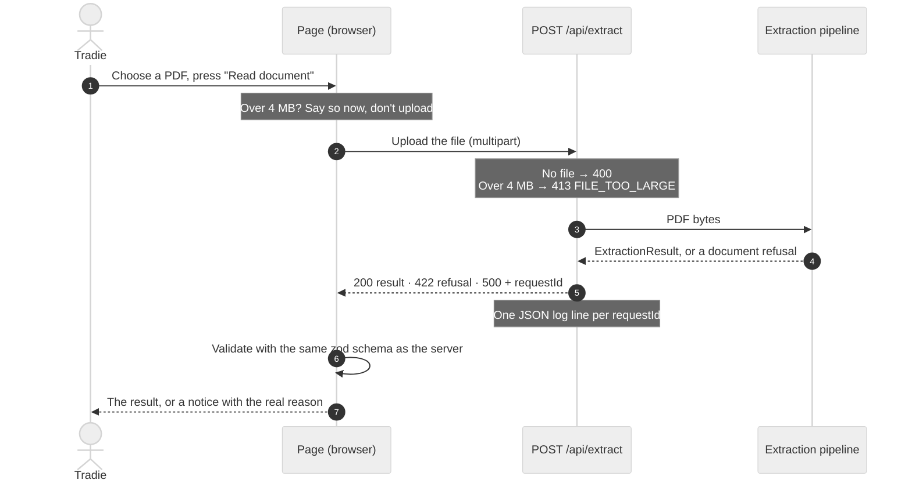
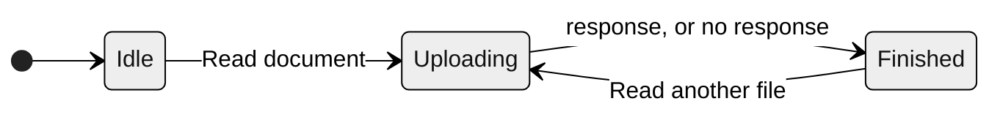

# Insta Quote · PDF extraction with evidence and refusals

This is my take-home for the full-stack role at Insta Quote AI. It has two parts:

- **Part A** is an API, `POST /api/extract`. You send it a supplier PDF and it sends back the line items it could read. Every value comes with the page and the exact printed row it came from. Anything it refused to read is listed separately, with the reason.
- **Part B** is a single page that uploads a PDF and shows the result, with every refusal explained in plain words a tradie would understand.

You can try it at **https://insta-quote-extract.vercel.app**. Upload any PDF from [`fixtures/pdfs`](fixtures/pdfs), or call the API directly. Every push to `main` redeploys it.

The rule I built everything around comes from the brief: never output a number you can't point to. Refusing is a valid answer; guessing isn't.

The original brief, my spec and my notes on each sample file are in [`docs/`](docs/). Every judgment call I made, and what it cost, is logged in [`docs/DECISIONS.md`](docs/DECISIONS.md).

## Running it

You'll need Node 22 or later.

```bash
npm install
npm run dev                # http://localhost:3000
npm test                   # vitest, in node and jsdom
npm run typecheck
npm run lint
npm run extract:fixtures   # writes out/<fixture>.json for every sample PDF
```

## The API

```bash
curl -F "file=@fixtures/pdfs/KBS-10262.pdf" https://insta-quote-extract.vercel.app/api/extract
```

Here's a trimmed version of the real response for that file:

```json
{
  "status": "needs_review",
  "lineItems": [
    {
      "id": "p1-l1",
      "section": "packing_list",
      "quantity": {
        "value": 96,
        "raw": "96",
        "evidence": { "page": 1, "sourceText": "1 10mm GIB Standard board 2400x1200 96 sheet $24.90 $2,390.40" }
      }
    }
  ],
  "refusals": [
    {
      "code": "CONFLICTING_VALUES",
      "scope": "document",
      "candidates": [
        { "value": 14, "raw": "14 pallets", "evidence": { "page": 1, "sourceText": "Summary: 14 pallets loaded at depot, all strapped and wrapped." } },
        { "value": 16, "raw": "16 pallets", "evidence": { "page": 1, "sourceText": "Driver notes: 16 pallets unloaded at site, all accounted for on the day." } }
      ],
      "userMessage": "The number of pallets doesn't match: the document says \"14 pallets\" and \"16 pallets\" in different places. We haven't picked one.",
      "suggestedAction": "Check with the supplier or driver which number of pallets is correct."
    }
  ]
}
```

Every value it extracts has the shape `{ value, raw, evidence: { page, sourceText, bbox } }`. `raw` is exactly what was printed (`"$68.00 /bag"`, not `68`), it's always a substring of `sourceText`, and `sourceText` is always one line of that page's text. That's what makes every number traceable.

A refusal is a normal result, not an error, so a document is a 200 even when nothing on it could be read:

| Case | Status | Body |
|---|---|---|
| Processed, **including when everything was refused** | 200 | `ExtractionResult` |
| No file / body isn't multipart | 400 | `{ error: { code: "NO_FILE", userMessage, requestId } }` |
| Over 4 MB | 413 | `{ refusal: FILE_TOO_LARGE, requestId }` |
| Not a PDF (by magic bytes), encrypted, 0 pages | 422 | `{ refusal, requestId }` |
| Real failure | 500 | honest message + `requestId`, no stack |

Every response carries an `x-request-id` header, and the server writes one JSON log line per request with the status, page count and refusal codes. The browser checks every response against the same zod schema the server uses, so a malformed response can't slip through as a result.

## Results on the six sample files

These come from `npm run extract:fixtures`, and they match [`fixtures/expected.json`](fixtures/expected.json) exactly: status, line count, line values, the full set of refusals, totals and page statuses. `tests/fixtures.test.ts` checks this on every run.

| File | Trap | Status | Lines | Printed total | Refusals |
|---|---|---|---|---|---|
| KBS-10234 | none (clean control) | complete | 5 | $2,630.00 | none |
| KBS-10241 | whole file is a scan | nothing_extracted | 0 | — | NO_TEXT_LAYER p1 |
| KBS-10255 | no Unit / Line Total columns, weights with no basis | needs_review | 4 | — | COLUMN_NOT_PRESENT ×2, AMBIGUOUS_UNIT_BASIS ×3 |
| KBS-10262 | 14 pallets loaded vs 16 unloaded | needs_review | 3 | $5,122.40 | CONFLICTING_VALUES (both candidates, none chosen) |
| KBS-10270 | lines don't add up to the printed total | needs_review | 4 | $1,612.90 | TOTAL_MISMATCH (cites only the printed total) |
| KBS-DR118 | 8 pages: p4 scanned, p5–8 not deliveries | needs_review | 21 | — | NO_TEXT_LAYER p4, NON_DELIVERY_SECTION p5–8 |

A few things worth pointing out:

- In **KBS-10255**, `$68.00 /bag` gives a price basis of `bag`, but the quantity gets no unit, because the document never says what the 4 is. Nothing is worked out either: no line totals, no summed weights.
- In **KBS-10270**, the lines add up to 1,538.20 against a printed total of 1,612.90. Neither the sum nor the 74.70 gap appears anywhere in the output, and there's no made-up "freight" line to explain it.
- In **KBS-DR118**, the 9 delivery lines and the 12 lines from the summary, returns, credit and acceptance pages are tagged by section and never added together. Page 4 being a scan doesn't affect any other page.

## How it works

### One request, end to end



### The extraction pipeline

Extraction runs in three stages. The middle stage runs separately for each page, so one bad page can't take the others down with it. The provenance guard and the cross-checks run once, over the whole document, after every page has been read.


When something can't be read safely, I refuse it at the smallest scope I can and keep everything else. This table shows where each refusal comes from:

| Stage | What went wrong | Refusal | Scope | What happens |
|---|---|---|---|---|
| Upload | File over 4 MB | `FILE_TOO_LARGE` | document | HTTP 413, nothing read |
| ① File | Not a PDF, password-protected, or no pages | `NOT_A_PDF` · `ENCRYPTED` · `EMPTY_DOCUMENT` | document | HTTP 422, nothing read |
| ② Page | No text layer (a scan) | `NO_TEXT_LAYER` | page | That page is skipped; the others continue |
| ② Page | The page throws, or cites text that isn't on it | `PAGE_PARSE_FAILED` | page | That page is skipped; the others continue |
| ② Page | Summary / returns / credit / acceptance page | `NON_DELIVERY_SECTION` | page | Lines kept and tagged, not counted as delivered; their counts are left out of the conflict check |
| ② Page | No table header, a repeated column, or no items under the header | `UNRECOGNISED_LAYOUT` | page | Nothing taken from that page |
| ② Page | No Unit or Line Total column | `COLUMN_NOT_PRESENT` | page | One note per missing column; nothing is computed to fill it |
| ② Cell | Blank, `TBC`, `N/A`; or `1.250`, `approx 20` | `MISSING_VALUE` · `AMBIGUOUS_NUMBER_FORMAT` | field | That value is left out; the rest of the line is kept |
| ② Cell | A weight like `25kg` with no per-item or total | `AMBIGUOUS_UNIT_BASIS` | field | Kept exactly as printed, and flagged |
| ③ Guard | A value that isn't in its source row, on its page | `VALUE_NOT_IN_SOURCE` | field | That value is dropped |
| ③ Checks | Qty × unit price ≠ printed line total | `LINE_ARITHMETIC_MISMATCH` | line | All three printed values shown; none corrected |
| ③ Checks | Lines don't add up to the printed total | `TOTAL_MISMATCH` | document | Only the printed total is cited; no sum or gap is shown |
| ③ Checks | One count noun with different numbers ("14 pallets" / "16 pallets") | `CONFLICTING_VALUES` | document | Every mention listed with its source; none chosen |

Extraction is deterministic: it reads the PDF's text layer by position, with no LLM and no OCR (D1, D2). Column positions come from the header text rather than hard-coded coordinates. The cross-checks work in integer cents, re-parsed from the printed text, and never write a computed number into the output (D3).

### The page (Part B)



The page state is a single discriminated union, and `Finished` holds exactly one of these outcomes. Each one has its own message:

| Outcome | When | What the user sees |
|---|---|---|
| `result` | 200, **including when everything was refused** | Summary banner, page chips, "Needs your attention", then page by page with each problem next to its row |
| `rejected` | 422 | The refusal's own message, what to do, and a reference |
| `tooLarge` | Over 4 MB (checked before upload), or a 413 from the platform | The 4 MB limit in plain words |
| `badRequest` | 400 | "We didn't receive a file…" |
| `serverError` | 500 | An honest message and the reference to quote |
| `networkError` | The request never reached the server | "Couldn't reach the server. Check your connection and try again." |
| `invalidResponse` | Not JSON, or fails the shared schema | "The server sent a response we couldn't understand", with the reference if there is one |

None of them ever says "something went wrong".

### How the rules are tested

I didn't want these rules to live only in the code, so the tests check them directly:

- `fixtures.test.ts` runs every sample file and checks that every value traces back to a line on the page it names, that every number shown to the user is printed in the PDF, and that none of the fixture's forbidden numbers appear.
- `pipeline.test.ts` forces page 2 to throw and checks that pages 1 and 3 still come through. It also feeds in forged values and checks that they're dropped and never appear anywhere.
- `result-view.test.tsx` and `page-states.test.tsx` check that every refusal message reaches the screen word for word, for every sample file and every HTTP outcome. To make sure these tests actually catch the bug the brief describes, I temporarily replaced the messages with "Something went wrong" and confirmed they failed.

## The three questions

### What was the hardest decision, and why did I make it that way?

Refusing scanned pages instead of running OCR on them (D2).

KBS-10241 is perfectly readable to a person, and its numbers add up. The product mindset is "say yes", so sending back nothing for it feels wrong, and of all the refusals it's the one I'm least comfortable with from a product point of view.

I refused anyway, because OCR output is itself a guess about pixels. If a `3` is read as an `8`, or a `1` as a `7`, that becomes a confident number in someone's quote, and the brief is clear that a confidently wrong number is worse than an honest "we couldn't read this". Without a confidence score for each character and a person confirming the result, OCR text isn't "the exact source text".

So the scanned page is refused on its own, the other pages carry on, and the message tells the user what to do: upload the original digital PDF or enter those items by hand. The same reasoning is why there's no LLM in the extraction path (D1). It would add a way to hallucinate numbers, and then I'd need a verifier to catch them.

The second-hardest call was where to enforce provenance (D12). My first version checked the finished result and patched it up afterwards. That produced output that contradicted itself, like a conflict left showing only one of its two values. I moved the check to where each value enters the pipeline, before any cross-check uses it, so every refusal stays whole.

### Where am I not confident?

- **I've only seen one supplier's layout.** All six files come from the same generator, with one text run per cell and left-aligned columns. A real invoice with wrapped descriptions, merged cells or right-aligned amounts will often be refused as an unrecognised layout. That's safe, but it isn't useful.
- **Rows can go missing without a refusal.** The table ends at the first row whose item number isn't a plain integer, such as a wrapped description, `3a` or `1.`. Anything after that row is neither read nor refused, and the total check would then blame the supplier for rows I failed to read. This is the gap that worries me most. The coverage check below would close it.
- **I might be too strict about units (D5).** "4" at `$68.00 /bag` is almost certainly 4 bags, but I don't set the unit to "bag" because the document doesn't actually say so. A real user might find that pedantic.
- **Some of it is keyword matching.** Page sections come from keywords in the subtitle, so an address like "Credit St" would make a delivery page look like a credit page (which fails safe). The conflicting-count check uses a fixed list of nouns, and the note that explains a total mismatch is found by keywords too.
- **Totals are checked page by page.** A total on the last page that covers several pages would be wrongly flagged.
- **Damaged PDFs get a slightly wrong message.** A file that starts like a PDF but won't open is told it "isn't a PDF file" (D8).
- **Not everything was checked by hand.** I clicked through DR118, 10262, 10241, 10255 and 10270 in a real browser (10270 on the live site), plus a renamed text file and a stopped server, at desktop and phone width. KBS-10234 is covered by the render tests and curl only.
- **Some things aren't handled at all:** GST and currency never appear in the samples, so amounts are shown exactly as printed. Uploads over Vercel's ~4.5 MB limit on a self-hosted server aren't handled either.

### What would I do with three more days?

1. **Add a coverage check.** Every number on a page would have to end up either in a line or a total, or be listed in a refusal as unaccounted for. That turns the "missing rows" gap into an explicit refusal.
2. **Use OCR as a confirmation step, never as data.** Scanned pages would get OCR with per-character confidence, shown as "read from the image, please confirm". Nothing would count until a person accepts it, and accepted values would be stored with `source: "user"` (the schema already has room for this).
3. **Let an LLM propose rows for layouts I don't recognise.** Every value it proposes would still go through the same provenance guard, so it could suggest structure but never introduce a number.
4. **Let users resolve refusals in the UI**, for example picking 14 or 16 pallets, or typing a missing price. Those values would be marked as the user's and never written back as if they'd been printed.
5. **Test against more layouts.** I'd collect real invoices (with permission) and generate variations in column order, alignment and wrapping, checking that the provenance rules always hold and that anything unrecognised fails closed.
6. **Show the evidence on the page image.** Every value already carries its `bbox`, so the page could be rendered with the value highlighted where it was printed.

## Where I departed from the spec

Each of these is explained in [`docs/DECISIONS.md`](docs/DECISIONS.md):

- **D8:** text runs are trimmed, and a damaged PDF gets a 422 `NOT_A_PDF`.
- **D9:** `0.500` is read as a decimal rather than refused as ambiguous.
- **D10:** a line with an unreadable description keeps its other values.
- **D11:** a header with a repeated column, or with no items under it, is refused rather than guessed at.
- **D12:** provenance is checked where values enter the pipeline, not patched afterwards.
- **D13:** the page has one "Uploading and reading…" state, because `fetch` can't tell when the upload finishes.
- **D14:** the UI is built on shadcn/ui, with a loading skeleton.

I didn't use tRPC even though the team does, because it doesn't handle multipart file uploads well. The upload goes to a plain Route Handler instead, and the shared zod schema gives the same type safety from end to end.

## How I built it

I built this with Claude Code, and the history shows the process:

- I planned the work as Linear epics, one per milestone in [`docs/PLAN.md`](docs/PLAN.md). Every commit has its own ticket (the `IQE-n` in the subject line), with its acceptance criteria and notes.
- Every code change went through an automated code review before it was committed, and each ticket records what the review found and how I fixed it. Plenty of the findings were real bugs: `n/a` being read as a price basis, the provenance guard leaking the very value it dropped, "Not on document" shown for a value that was printed but couldn't be read, and a browser API that would have crashed the results on older iPhones.
- I ran an audit of the extraction output against the provenance rules twice, once after the pipeline was done and again before submitting.
